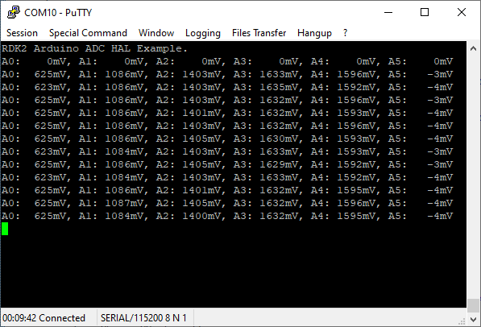
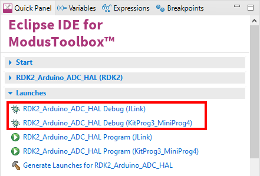

# RutDevKit-PSoC62 Arduino ADC HAL Example

Rutronik Development Kit Programmable System-on-Chip CY8C6245AZI-S3D72 "Hello World" Example. 

This example demonstrates how to use HAL library to measure all the ADC channels on the Arduino ADC header. 

 

### Using the code example with a ModusToolbox IDE:

1. Import the project: **File** > **Import...** > **General** > **Existing Projects into Workspace** > **Next**.
2. Select the directory where **"RutDevKit-PSoC62_Arduino_ADC_HAL"** resides and click  **Finish**.
3. Select and build the project **Project ** > **Build Project**.

### Operation

The firmware example uses KitProg3 Debug UART for the debug output. The ADC peripheral measures all the Arduino ADC channels continuously in a callback function:

```
static void adc_continuous_event_handler(void* arg, cyhal_adc_event_t event)
```

The ADC initialization is done in a function:

```
cy_rslt_t app_hw_init(void)
```

The data is read from the data array and printed to the terminal every second:



### Debugging

If you successfully have imported the example, the debug configurations are already prepared to use with a the KitProg3, MiniProg4, or J-link. Open the ModusToolbox perspective and find the Quick Panel. Click on the desired debug launch configuration and wait for the programming completes and debug process starts.



## Legal Disclaimer

The evaluation board including the software is for testing purposes only and, because it has limited functions and limited resilience, is not suitable for permanent use under real conditions. If the evaluation board is nevertheless used under real conditions, this is done at one’s responsibility; any liability of Rutronik is insofar excluded. 


